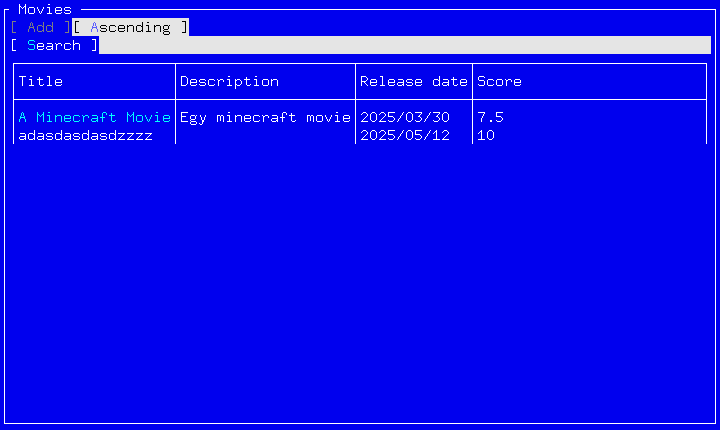

# Film értékelő alkalmazás

## Tervezett funkciók

### CRUD műveletek

- [x] Felhasználók kezelése
  - felhasználónév
  - jelszó
  - admin-e?
- [x] Emberek kezelése
  - név
  - születés/halálozás dátuma
  - leírás
- [x] Filmek kezelése
  - cím
  - leírás
  - megjelenés dátuma
- [ ] Szereplések kezelése
  - ember
  - film
  - szerep
- [x] Értékelések kezelése
  - film
  - értékelés (0-10)
  - leírás

### Lekérdezések

- [x] Emberek listázása
- Filmek listázása
  - [x] ABC sorban
  - [x] szűrés cím szerint

## Konfiguráció

A rendszer minden adatot Json fileokban tárol, ezeket alpból a futtatott program mellet keresi, de konfigurálható környezeti változókkal vagy parancssori paraméterekkel. Pl. a felhasználókat tároló file `MOVIE_USERSPATH=/valami/users.json` környezetiváltozóval vagy `--userspath=/valami/users.json` argumentummal.

- UsersPath: felhasnálók
- PeoplePath: filmen dolgozó embeker
- MoviesPath: filmek
- AppearancesPath: emerek és filmek kapcsolótáblája

A `--help` argumentummal elérhető a kapcsolók listája. \
A `--demomode true` kapcsolóval új adatbázis fájlok jönnek létre demo adatokkal. Kettő felhasználót hoz létre:

- admin: admin
- user1: user1

## Felület

A program a felület megjelenítéséhez a Terminal.Gui csomagot használja.\
Nyilakkal, tab-bal vagy egérrel lehet lépkedni a menükben. Enter vagy kattintás választ ki mezőt/gombot. Escape a vissza vagy kilépés.

## Követelmények teljesítésére példák

- try-catch: [Program.cs:29](Program.cs)
- hibaüzenet kiírása: [MoviesListWindow.cs:146](view/console/movies/MoviesListWindow.cs)
- szerializáció: [UserJsonDAO.cs:18](dao/json/UserJsonDAO.cs)
- record type: [User.cs](model/User.cs)
- LINQ: [MovieController.cs:39](controller/MovieController.cs)
- generikus kollekció: [MovieController.cs:65](controller/MovieController.cs)
- aszinkron rész: [MovieController.cs:62](controller/MovieController.cs)

## TODO

- Szereplések kezelése
